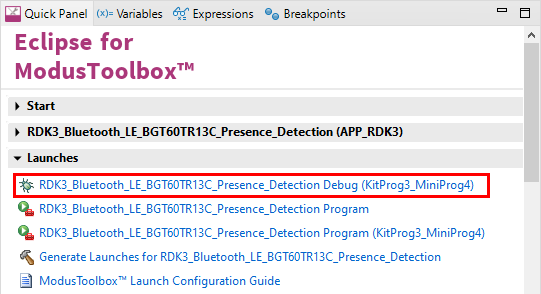

# RDK3 - Presence detection using BGT60TR13C

Rutronik Development Kit 3 Programmable System-on-Chip CYB06447BZI-BLD53 "Presence detection" Code Example.

This code example demonstrates the Infineon XENSIV™  Presence Detection algorithm.


## Requirements

- [ModusToolbox® software](https://www.infineon.com/cms/en/design-support/tools/sdk/modustoolbox-software/) **v3.x** [built with **v3.1**]
- [RAB3-Radar](https://github.com/RutronikSystemSolutions/RAB3_Radar_Hardware_Files) Rev1

- [ModusToolbox® software](https://www.infineon.com/cms/en/design-support/tools/sdk/modustoolbox-software/) **v3.2**: 

1. The [Python](https://www.python.org/) has to be installed manually on Windows OS.
2. Make sure the Python installation is added to the path variable. 
3. Use this command to install the [cysecuretools](https://pypi.org/project/cysecuretools/) package:

```
pip install cysecuretools
```

## Supported toolchains (make variable 'TOOLCHAIN')

- GNU Arm&reg; Embedded Compiler v11.3.1 (`GCC_ARM`) - Default value of `TOOLCHAIN`

## The Provisioning of the RDK3

The CYB06447BZI-BLD53 device must be provisioned with keys and policies before being programmed. If the kit is already provisioned, copy-paste the keys and policy folder to the application folder. If the unsigned or not properly signed image will be written to the RDK3 PSoC™ 64 – the microcontroller will not boot. 

The “[Secure Policy Configurator](https://www.infineon.com/dgdl/Infineon-ModusToolbox_Secure_Policy_Configurator_1.30_User_Guide-UserManual-v01_00-EN.pdf?fileId=8ac78c8c8386267f0183a960762a5977)” tool is used for the provisioning of the new RDK3, please refer to the “ModusToolbox™ Secure Policy Configurator user guide”. 

The CYB06447BZI-BLD53 MCU must be powered from a 2.5V power source to be able to complete the provisioning. The RDK3 has an SMPS [Switching Mode Power Supply] which can be easily adjusted to provide 3.3V or 2.5V to the MCU by switching the slide-switch “SW1” on the bottom side of the board. 


Please note that the “[Secure Policy Configurator](https://www.infineon.com/dgdl/Infineon-ModusToolbox_Secure_Policy_Configurator_1.30_User_Guide-UserManual-v01_00-EN.pdf?fileId=8ac78c8c8386267f0183a960762a5977) 

### Using the code example with a ModusToolbox™ IDE:

1. Import the project: **File** > **Import...** > **General** > **Existing Projects into Workspace** > **Next**.
2. Select the directory where **"RDK3_Radar_Presence_Detection"** resides and click  **Finish**.
3. Update the libraries using a **"Library Manager"** tool.
4. Select and build the project **Project ** > **Build Project**.

### Operation

This code example will output the results of the presence detection algorithm in 2 ways: directly on the console (using the KitPro3UART) or over BLE.


#### Change the radar configuration
You can change the radar configuration used to measure by generating a new "radar_settings.h" configuration.

Use the tool provided by Infineon “[Radar Fusion GUI](https://softwaretools.infineon.com/tools/com.ifx.tb.tool.ifxradargui)” to generate a new version of the file.

#### Change the configuration of the presence detection algorithm
The configuration of the presence detection algorithm can be directly changed inside the rutronik_app.c file.

```
static const xensiv_radar_presence_config_t default_config =
{
    .bandwidth                         = XENSIV_BGT60TRXX_CONF_END_FREQ_HZ - XENSIV_BGT60TRXX_CONF_START_FREQ_HZ,
    .num_samples_per_chirp             = XENSIV_BGT60TRXX_CONF_NUM_SAMPLES_PER_CHIRP,
    .micro_fft_decimation_enabled      = false,
    .micro_fft_size                    = 128,
    .macro_threshold                   = 0.5f,
    .micro_threshold                   = 12.5f,
    .min_range_bin                     = 1,
    .max_range_bin                     = 6,
    .macro_compare_interval_ms         = 250,
    .macro_movement_validity_ms        = 1000,
    .micro_movement_validity_ms        = 4000,
    .macro_movement_confirmations      = 0,
    .macro_trigger_range               = 1,
    .mode                              = XENSIV_RADAR_PRESENCE_MODE_MICRO_IF_MACRO,
    .macro_fft_bandpass_filter_enabled = false,
    .micro_movement_compare_idx       = 5
};
```


#### Powering the RDK3 from the single-cell Li-ION/Li-PO battery

The RAB3-Radar adapter board needs to be powered from a +5V power supply source via Arduino Headers. If the USB-C cable is connected with RDK3 and PC, the power is already supplied without any additional setup. 

To make this demo portable and use it with Li-PO(or Li-ION) batteries, the OTG booster needs to be activated. This demo has a very simple method implemented which allows users to enable the boost mode of the [DIO59020](https://www.dioo.com/uploads/product/20210520/9fdd66c936d397ab75a4638578b09190.pdf) charger just by pressing a button USER BTN1.

- Connect the single-cell Li-PO or Li-ION battery, please respect the polarity. It would be best if the battery would have an internal protection circuit integrated.

- Switch the SW3 upwards to the "BATTERY" position.

- Mount the RAB3-Radar adapter board.

- Press and hold the button USER_BTN1 and then press and release a RESET Button. Notice if the GREEN LED D7 - "POWER" lights up.

- Release the USER_BTN1. The YELLOW blinking LED1 D8 indicates that the system is running and is ready for connection with a smartphone via Bluetooth LE. 

  NOTICE 1: this demo does not have power-saving and self-shutting down algorithms implemented yet. The switch SW3 must be switched down to the +5V/KitProg position if the development kit is not used. This is especially important if you are using batteries without the protection circuits integrated (never allow for the voltage of the battery to fall below 3 volts).

  NOTICE 2: The charging will not work if the boost mode is engaged. You need to restart the demo without pressing USER_BTN1.

  NOTICE 3: The battery charging current may be adjusted in code in `battery_booster.c`:

  ```c
      	/*The charging current depends on your battery used*/
      	dio_set_batt_current(CURR_VREF_101_8);
  ```


### Debugging

If you successfully have imported the example, the debug configurations are already prepared to use with a the KitProg3, MiniProg4, or J-link. Open the ModusToolbox™ perspective and find the Quick Panel. Click on the desired debug launch configuration and wait for the programming to complete and the debugging process to start.



## Libraries

The project contains a local copy of the sensor-xensiv-bgt60trxx.
Modifications have been made inside the file xensiv_bgt60trxx_mtb.c to detect timeout during SPI transfers.

## Legal Disclaimer

The evaluation board including the software is for testing purposes only and, because it has limited functions and limited resilience, is not suitable for permanent use under real conditions. If the evaluation board is nevertheless used under real conditions, this is done at one’s responsibility; any liability of Rutronik is insofar excluded. 


